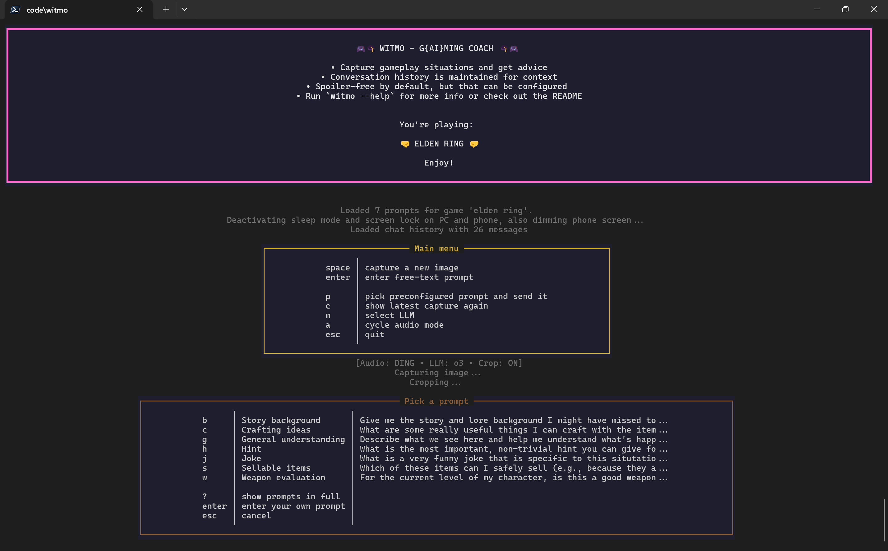
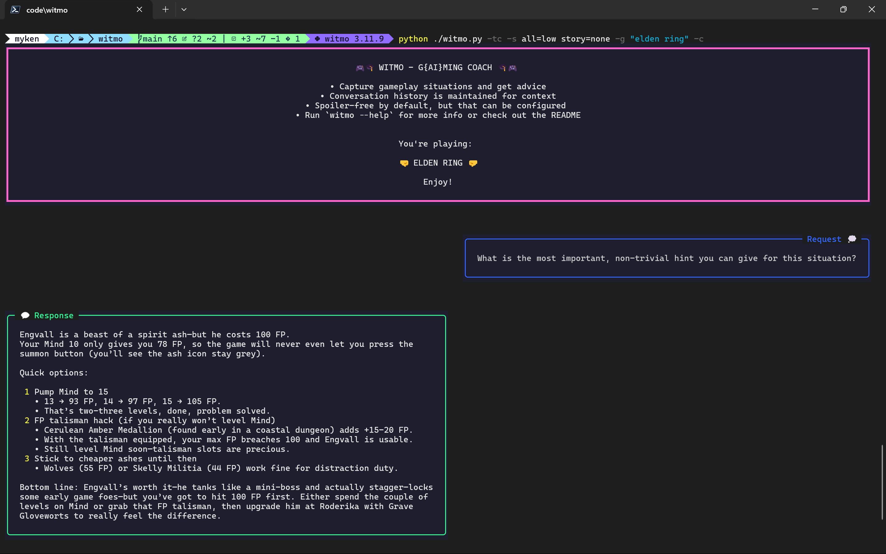
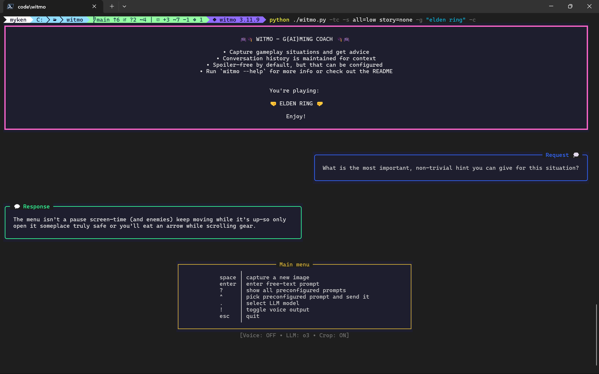

# 🎮 Witmo - your personal g{ai}ming coach 🎓

Witmo is your friendly AI-powered gaming coach: it captures gameplay images, analyzes
your situation, and gives you specific, spoiler-aware advice — just like a pro gamer
buddy.




---

## ✨ Key features

- 📸 **Screen capture**: Connects to your Android phone via USB to capture gameplay
  images
- ✂️ **Auto-cropping**: Crops captures to focus just on the game screen
- 🔍 **Image analysis**: Uses cloud-based LLMs to understand what's happening in your
  game
- 💬 **Contextual advice**: Provides tips and insights specific to your current
  situation and your request
- 🙈 **Spoiler control**: Customizable spoiler levels to avoid ruining your gaming
  experience
- 🎵 **Audio feedback**: Optional text-to-speech and sound notifications
- 📝 **Conversation history**: Maintains context of your previous questions
- 🎮 **Game-specific prompts**: Tailored prompts for supported games
- 🖥️ **Terminal-based interface**: No other UI (whether you call that a feature or not
  is up to you...)

## 📋 Requirements

- Python 3.11+ 
- An Android device with USB debugging enabled and connected to your computer
- OpenAI API key

## 🚀 Installation

1. Clone this repository:
   ```bash
   git clone https://github.com/ymyke/witmo.git
   cd witmo
   ```

2. Install the required Python packages:
   ```bash
   # Optionally set up a virtual environment
   pip install -r requirements.txt
   ```

3. Set up your OpenAI API key as an environment variable:
   ```bash
   # On Windows
   setx OPENAI_API_KEY "your-api-key-here"
   
   # On Linux/macOS
   export OPENAI_API_KEY="your-api-key-here"
   ```

## 📱 Phone setup

1. Enable developer options on your Android device:
   - Go to Settings > About Phone.
   - Tap "Build Number" seven times until you see "You are now a developer!"

2. Enable USB debugging:
   - Go to Settings > System > Developer Options.
   - Enable "USB Debugging".
   - Connect your phone to your computer via USB.
   - Select "Allow USB Debugging" when prompted on your phone.
   - Security note: Your phone will authenticate your computer and only allow
     connections from it in the future.

3. Prepare your camera app:
   - Open your phone's camera app.
   - Position it so it has a clear view of your gaming screen.
   - Make sure the camera app is in the foreground before starting Witmo.

## 🎮 Usage

### Basic command

Make sure your phone is connected, unlocked, and camera app is open. Then run Witmo.
Here's what my usual command looks like:

```bash
python ./witmo.py -c -d -a ding -s all=high story=none -g "elden ring"
```


### Main command line options

| Option                  | Description                                   |
| ----------------------- | --------------------------------------------- |
| `-g`, `--game`          | **Required**. Name of the game being played   |
| `-d`, `--delete-remote` | Delete captured images from phone             |
| `-s`, `--spoilers`      | Set spoiler levels (see below)                |
| `-c`, `--crop`          | Auto-crop images to the TV/screen area        |
| `-a`, `--audio`         | Audio mode: `off`, `voice`, `ding`, or `both` |

Show all options with `-h` or `--help`. The remaining options are mostly for debugging
and testing purposes.


## 🙈 Spoiler control

You can control what types of spoilers Witmo is allowed to reveal using the `--spoilers`
flag and setting levels for different categories. The levels are:

- `none`: No spoilers, generic advice only
- `low`: Broad hints, no specific names or locations
- `medium`: Concrete strategies, may include names and item categories
- `high`: Full deep details, including stats and plot twists

The categories are:

- `items`, `locations`, `enemies`, `bosses`, `story`, `lore`, `mechanics`
- `all` for a blanket setting across all categories

You can combine these in a single command. For example, to set all spoilers to medium,
story to none, and mechanics to high:

```bash
--spoilers all=medium story=none lore=high mechanics=high
```

Behind the scenes, the settings are added to the system prompt sent to the AI. So this
depends on the model's ability to respect these preferences. See also
[`witmo/spoilers.py`](witmo/spoilers.py)) for full details. For example, there's also
these two rules:

> If it's clear where the player currently is in the game's progression, you may freely
reference any content up to that point (past). Only details beyond that point (future)
are subject to the spoiler-level rules below. Always give rich, local detail—only future
content is gated by spoilers. 

> On all levels above "low," you should mention any key items, quests, or mechanics the
user absolutely shouldn't miss for later in the game.  


## 🧠 Language models

Witmo currently supports 3 OpenAI models (o3, gpt-4o, and gpt-4.5-preview) and you can
switch between them at runtime.


## 📝 Conversation history

Witmo maintains conversation history to provide context for the AI:

- Each game has its own conversation history.
- History is stored in the `history/<game-name-slug>` directory, e.g.,
  `history/elden-ring`. (So please make sure to use consistent game names.)
- Images are saved for future reference. (The cropped images are saved implicitly in
  `chat_history.json`.)
- The most recent 10 messages are sent to the LLM for context.


## ⚙️ System prompt

Check out [`witmo/llm/system_prompt.py`](witmo/llm/system_prompt.py).


## 🔊 Audio features

Witmo offers several audio modes to enhance your experience:

| Mode    | Description                                                                    |
| ------- | ------------------------------------------------------------------------------ |
| `off`   | No audio feedback (default)                                                    |
| `ding`  | Play a notification sound when responses arrive                                |
| `voice` | Use text-to-speech to read AI responses aloud (using OpenAI's TTS API (tts-1)) |
| `both`  | Combine notification sounds and text-to-speech                                 |


## 🗂️ Prompt packs

Witmo uses "prompt packs" to provide game-specific prompts. 

- If a prompt pack exists for your game (like Elden Ring), Witmo will use it
  automatically for more specific advice.
- If no prompt pack is found for your game, Witmo falls back to a default set of prompts
  designed to work generically with most games.
- You can create and add your own prompt packs to extend Witmo for new games — just add
  your custom prompts to the [`prompt_map.json`](prompt_map.json) file. If you do,
  please consider contributing them back to the project so others can benefit too.

## 🌱 Genesis & contributing

I built Witmo after picking up Elden Ring and constantly finding myself with questions
mid-game. I wanted a tool that would let me quickly ask for advice based on a screenshot
— no need to type out long explanations for the LLM.

Contributions, ideas, and feedback are welcome! If you have suggestions, bug fixes, or
want to add features or additional prompt packs, feel free to open an issue or pull
request.

## ⚖️ License

This project is licensed under the MIT License. See the [LICENSE](LICENSE) file for
details.

## ⚠️ Limitations

- **Game support:** Currently only Elden Ring is fully supported out of the box. You can
  use Witmo with any game by adding a prompt pack, or rely on the default prompts for
  unknown games.
- **Platform testing:** Only tested on Windows with PowerShell/Terminal and Python 3.11.
  No testing has been done on other operating systems, shells, or Python versions.
- **Device compatibility:** Only works with Android devices (tested with Pixel 8). Other
  Android models, iOS devices, webcams, or other capture methods are not tested or
  supported.
- **LLM providers:** Only certain OpenAI language models are supported at this time.

## More screenshots



<br/>



